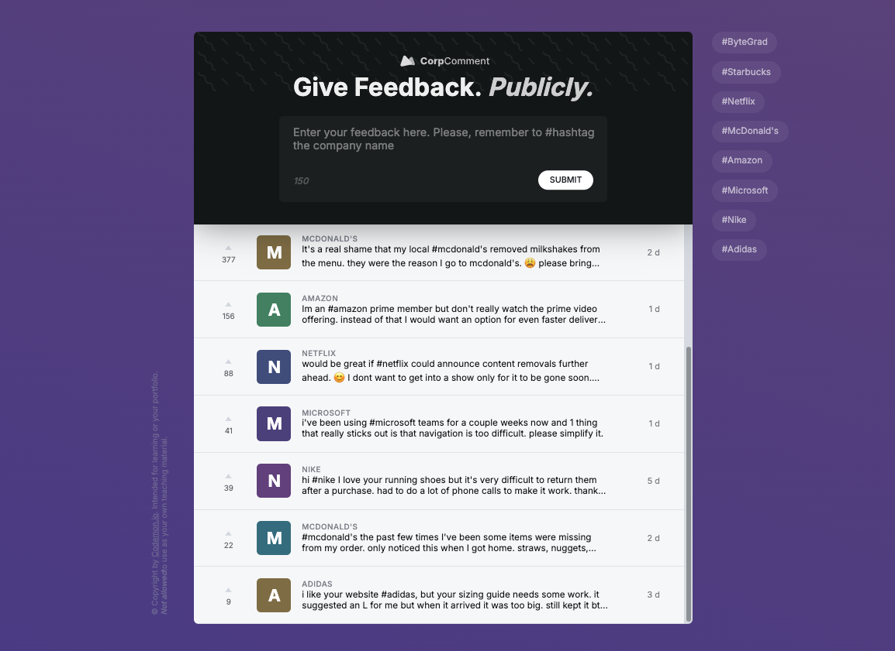

# Corporation

Corporation is a web application where users can post and browse company reviews. Built with Vite and React, the app allows users to share their own experiences with different companies and view reviews submitted by others. The reviews are fetched from an API and can be filtered by company, allowing users to easily find relevant feedback. Additionally, reviews submitted by users are sent to a backend database for persistence. State management is powered by Zustand, ensuring efficient and predictable state updates.

## Table of Contents
- [Story Behind the Project](#story-behind-the-project)
    - [The Problem](#the-problem)
    - [The Solution](#the-solution)
- [Features](#features)
- [Demo](#demo)
- [Usage](#usage)
- [Technologies Used](#technologies-used)
- [Project Structure](#project-structure)

## Story Behind the Project

### The Problem
In today's professional landscape, transparency is key when evaluating potential employers. While several platforms offer company reviews, many lack efficient filtering mechanisms or suffer from cluttered interfaces. Moreover, users often find it difficult to submit reviews seamlessly or have concerns about data persistence.

### The Solution
Corporation was created to provide a streamlined solution for both posting and browsing company reviews. It offers an intuitive interface for submitting reviews, fetching real-time data from an API, and sending new reviews to a backend database for persistence. The app also features powerful filtering capabilities to help users find feedback about specific companies. By keeping the interface minimal, users can focus on the content without distractions.

Zustand was chosen for state management to ensure a smooth, scalable, and predictable user experience.

## Features
- **Post Company Reviews**: Users can submit reviews about companies, and the data is sent to a backend database for persistence.
- **Browse and Filter Reviews**: Reviews are fetched from an API and can be filtered based on the selected company.
- **Real-Time Data Fetching**: The app fetches company reviews in real-time from an external API, ensuring that the most current information is available.
- **API Data Persistence**: Reviews posted by users are stored in a database, making the data available across multiple sessions.
- **State Management with Zustand**: Zustand provides reliable and scalable state management for handling reviews and filter selections.
- **Live Updates**: Reviews update in real-time, providing users with an up-to-date browsing experience.

## Demo
A live demo of Corporation is available at: [Corporation Demo Link](https://corporation-comment-web-app.vercel.app/)



## Usage
1. Open the application in your browser.
2. Post a company review by filling in the required fields and submitting.
3. Browse reviews by filtering through the list of companies.
4. Find detailed feedback about specific companies by selecting them from the list.
5. Reviews are fetched from the API, and new reviews are persisted to the database automatically.

## Technologies Used
### Frontend:
- **React**: JavaScript library for building user interfaces.
- **Vite**: Fast build tool for modern web projects.
- **Zustand**: Simple, scalable state management for React.
- **CSS**: Used for styling the application.
- **REST API**: For fetching and submitting review data.
- **TYPESCRIPT**: For types validation

### Backend:
- **Database**: For persisting user-submitted reviews.

### Development Tools:
- **JavaScript (ES6+)**: The core programming language used for the project.
- **Node.js**: JavaScript runtime for server-side execution and development.
- **npm**: Package manager for managing project dependencies.

## Project Structure
```bash
corporation/
├── public/             # Static assets
├── src/
│   ├── components/     # React components for the application
│   ├── App.tsx         # Main app component for React
│   ├── index.css       # Global styles
│   ├── main.jsx        # Entry point for React
│   ├── contexts        # All the contexts that has been replaced by zustand
│   ├── lib             # some libs
│   ├── store           # All state management using zustand
├── .gitignore          # Git ignore file
├── package.json        # Project metadata and scripts
└── vite.config.js      # Vite configuration
```
Corporation is designed to offer an efficient and intuitive solution for company reviews. Whether you're looking to share your experience or learn more about a company, Corporation provides a seamless platform for both submitting and browsing reviews.
